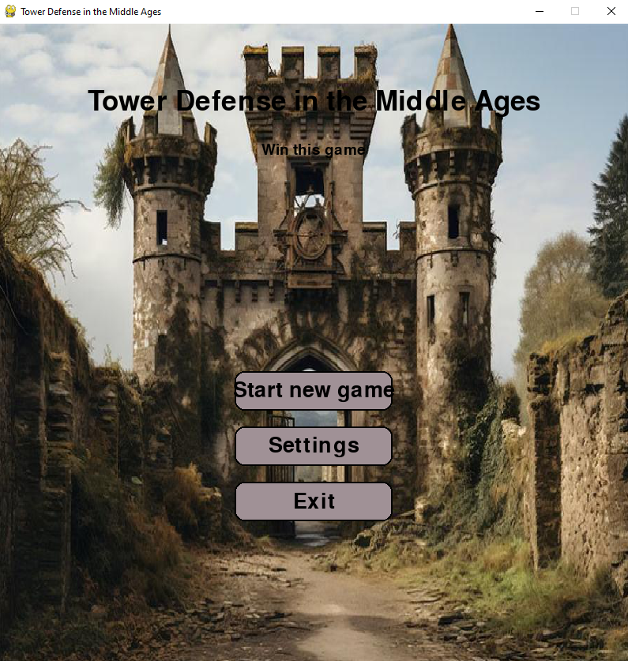
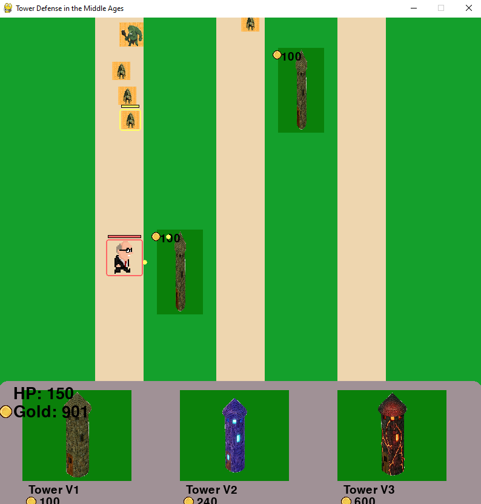

# Tower Defense in the Middle Ages

Классическая игра Tower Defense в сеттинге средневековья. Защищай базу от волн врагов, строя и улучшая башни!

## Как запустить

### Требования
- Python 3.10+
- Pygame

### Установка
```bash
# Создай виртуальное окружение (опционально)
python -m venv venv

# Активируй виртуальное окружение
venv\Scripts\activate

# Установи зависимости
pip install pygame
```

### Запуск
```bash
python main.py
```

## Управление

### Главное меню
- **Start new game** — начать новую игру
- **Settings** — выбрать сложность (Easy/Medium/Hard)
- **Exit** — выйти из игры

### Во время игры
- **Клик по иконке башни** (внизу экрана) — выбрать тип башни для постройки
- **Клик по зелёной ячейке** — поставить выбранную башню
- **Клик по установленной башне** — открыть меню улучшения/продажи
- **ESC** — выйти из игры

## Типы башен

| Башня | Цена | Урон | Радиус | Особенность |
|-------|------|------|--------|-------------|
| Tower V1 | 100 | 30 | 200 | Базовая башня, жёлтые снаряды |
| Tower V2 | 240 | 54 | 260 | Усиленная башня, синие снаряды |
| Tower V3 | 600 | 80 | 330 | Элитная башня, красные снаряды |

**Улучшение:** Каждая башня может быть улучшена до 5 уровня. С каждым уровнем растёт урон (+20% от базового), радиус атаки (+20) и стоимость следующего улучшения. На 5 уровне башня стреляет по двум целям одновременно!

**Продажа:** Башню можно продать за 50% от вложенных средств.

## Враги

| Враг | HP | Урон | Скорость | Награда |
|------|-----|------|----------|---------|
| Goblin | 70 | 14 | 23 | 20 золота |
| Ogre | 140 | 28 | 18 | 50 золота |
| Big Bob | 800 | 80 | 14 | 200 золота |

**Способности врагов:** При спавне враги могут получить случайную способность:
- **Strong** (+30% HP и урона)
- **Fast** (+40% скорости)
- **Monetary** (+40% золота за убийство)

Способность обозначается цветной рамкой вокруг врага и полоской над ним.

## Цель игры

Не дай врагам добраться до базы! Каждый враг, достигший нижней границы поля, наносит урон. Если HP базы падает до 0 — игра окончена.

## Структура проекта

```
game_from_exam/
├── main.py              # Точка входа, игровой цикл
├── controllers.py       # Контроллер: логика игры, обработка событий
├── models.py            # Модели: башни, враги, снаряды
├── views.py             # Представление: отрисовка всех элементов
├── constants.py         # Константы: цвета, размеры, координаты
├── test_game.py         # Тесты
├── assets/
│   └── images/          # Изображения: башни, враги, фон, взрывы
└── README.md            # Этот файл
```

## Технологии

- **Python 3.12**
- **Pygame 2.6.1** — библиотека для разработки игр
- **MVC архитектура** — чёткое разделение логики, данных и отображения

## Особенности реализации

- **Алгоритм поиска цели:** Башни стреляют по врагу, который ближе всего к базе (приоритет по Y-координате)
- **Двойной выстрел:** Башни 5-го уровня атакуют двух ближайших врагов одновременно
- **Система способностей:** Враги получают случайные модификаторы при спавне
- **Динамическая сложность:** Три уровня сложности влияют на HP, урон, скорость врагов и стартовое золото
- **Визуальная обратная связь:** Подсветка ячеек при наведении, радиус атаки, анимация взрывов

## Скриншоты





---

### Автор - Пульников Артём РИ-150911
